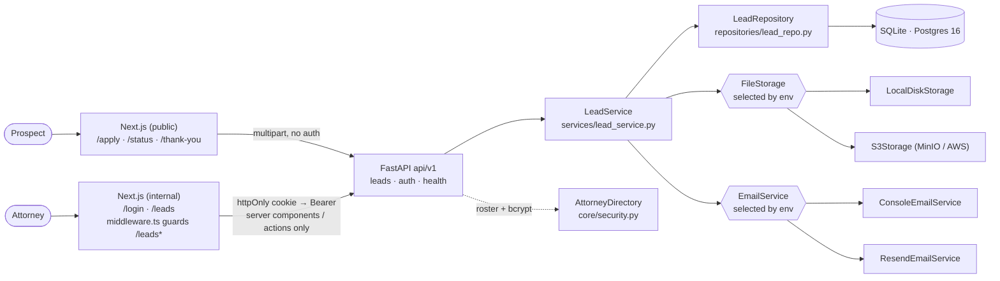
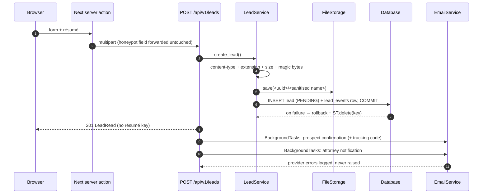
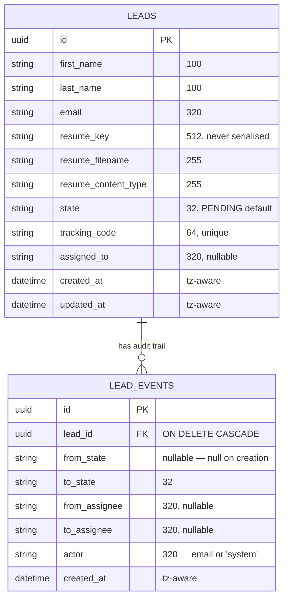
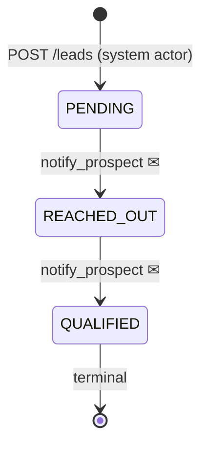

# Design — Alma Lead Intake

Author: Bhavana (decisions) · Claude Code (implementation). Every claim below was checked
against the code in this repo; anything not built is marked **Designed, not built**.

## 1. Problem & scope

A public form must accept a prospect's details plus a résumé, and an attorney must be able
to log in, see the queue, read the résumé, and move the lead through an intake pipeline.

> Context (from Alma's public job description, not from the brief): Alma's first market is
> immigration law, so résumés are treated as sensitive personal data; nothing else in the
> design depends on this.

**In scope:** FR1–FR10; core NFRs S1–S5, R1–R2, M1–M6, E1–E3, E5, P1–P2, A1, C1, $1.
**Out of scope (named, not built):** prospect self-service beyond a status lookup, RBAC /
admin role (S7), guaranteed email delivery (R3), duplicate detection (R4), retention and
deletion jobs (C2), an ops dashboard (EXT4), malware scanning (SEC2e), CAPTCHA (SEC4
Turnstile), and any LLM in the product path.

## 2. Architecture



Adapter selection happens once, in `api/app/core/deps.py` (storage, email, roster) and
`api/app/db/session.py` (engine). No service or router knows which implementation it got (M4/E2).

| Env var | Unset → default | Set → implementation |
|---|---|---|
| `DATABASE_URL` | `sqlite:///./data/alma.db` | `postgresql+psycopg://…` (Postgres 16) |
| `S3_ENDPOINT_URL` **or** `S3_ACCESS_KEY_ID` | `LocalDiskStorage(UPLOAD_DIR)` | `S3Storage` (MinIO or AWS) |
| `RESEND_API_KEY` | `ConsoleEmailService` | `ResendEmailService` |
| `ATTORNEYS` (JSON list) | single `ATTORNEY_EMAIL` / `ATTORNEY_PASSWORD` account | multi-attorney roster (`Settings.roster`) |
| `RATE_LIMIT_STORAGE_URL` | `memory://` (per process) | `redis://…` (shared across replicas) |
| `LOG_JSON` | text logs | one JSON object per line |

## 3. Request flows

### a. Submit a lead (FR1, R1, A1)



The file lands before the row so a storage outage fails as `503 storage_unavailable` with no
lead created; the row commits before any email is scheduled so a provider outage can never
lose an accepted lead. The compensating `storage.delete(key)` runs if the insert fails.

### b. Attorney marks a lead reached out (FR8/FR9, R2)

| Step | Where | Behaviour |
|---|---|---|
| 1 | `web/app/(internal)/leads/actions.ts` | server action reads the JWT from the httpOnly cookie; the browser never holds it |
| 2 | `PATCH /api/v1/leads/{id}/state` | `assert_transition()` is an advisory pre-check that produces the message |
| 3 | `LeadRepository.update_state` | `UPDATE leads SET state=… WHERE id=… AND state=<expected>`; `rowcount == 0` → 409 `invalid_transition` |
| 4 | same transaction | `lead_events` row (`from_state`, `to_state`, `actor` = attorney email), then commit; if the rule sets `notify_prospect`, a post-commit background task emails the prospect |

Already there → 409 `already_in_state`, which the UI treats as benign and refreshes.

### c. Prospect checks status (EXT1/SEC7)

| Step | Where | Behaviour |
|---|---|---|
| 1 | `/status` page + server action | code typed in; no account, no cookie |
| 2 | `GET /api/v1/leads/track/{code}` | rate limited per IP (`20/minute` default) |
| 3 | `LeadService.public_status` | uppercased, looked up, then `secrets.compare_digest`; unknown/malformed/empty all give the same 404 |
| 4 | response | `state`, `submitted_at`, `updated_at`, and a timeline of `{to_state, at}` — no name, email, filename, actor or lead id |

## 4. Data model



Indexes: `ix_leads_state`, `ix_leads_created_at` (the queue filters on state and sorts newest
first), `ix_leads_assigned_to`, a unique index on `tracking_code`, and `ix_lead_events_lead_id`.
Three Alembic migrations: `0001_leads`, `0002_events_tracking` (adds the audit table and
backfills a per-row tracking code before tightening to NOT NULL + UNIQUE), `0003_assigned_to`.

**Invariant: a lead's submitted content is immutable.** Only `state`, `assigned_to` and
`updated_at` are ever written after creation, and each of those writes appends a `lead_events`
row in the same transaction. Audit integrity is the reason: if the name, email or résumé could
be edited in place, the trail would describe a document that no longer exists. Assignment
changes reuse the events table with `from_state == to_state` and the two assignee columns
carrying the move.

## 5. Lead state machine



The whole machine is one dict in `api/app/services/lead_state.py`
(`TRANSITIONS: dict[LeadState, dict[LeadState, TransitionRule]]`). Adding a state (E1) is one
`LeadState` enum member, one `TRANSITIONS` entry, and — if the prospect should hear about it —
one row in `_STATUS_COPY` in `services/email/messages.py`; no router, service or repository
changes. Missing copy means no email rather than an empty one.

409 splits into two codes so the client can behave differently: `already_in_state` (benign —
someone or another tab already did it; the UI refreshes and says so calmly) and
`invalid_transition` (a move the pipeline forbids, or a lost race detected by the SQL guard).

## 6. Decisions

| Area | Driver | Choice | Rejected alternative | Price paid |
|---|---|---|---|---|
| Database | $1 zero-infra run, M4 | SQLite by default, Postgres 16 via `DATABASE_URL`; CI runs the whole suite against both | Postgres-only, docker-compose required | two engines to keep honest (UUID, tz, DDL differ) — paid for with a second CI job |
| Migrations | M3 | Alembic from the first table; `alembic check` in CI catches model/migration drift | `create_all()` | every schema change is a file, even in a 6-hour build |
| File storage | S2, E2, C1 | `FileStorage` Protocol; local disk default, `S3Storage` when configured | writing résumé bytes into the DB | a second consistency boundary (file vs row) → the compensating delete in §3a |
| Résumé delivery | S1/C1 | always proxied through an authenticated route; presigned URLs are optional extra | public/CDN URLs | résumé bytes traverse the API process |
| Email + timing | R1, A1 | commit first, send in `BackgroundTasks`, provider errors logged not raised | send inside the transaction | at-most-once delivery (§12) |
| Auth | S1, S4 | JWT (HS256, 8h) issued to a roster hashed with bcrypt at startup; token lives only in an httpOnly cookie, read server-side | token in `localStorage`; sessions in the API | no refresh tokens; a stateless API in exchange |
| Authorisation | FR10, E5 | roster in `ATTORNEYS` config; `assigned_to` holds an email, not an FK | an `attorneys` table now | no RBAC, no reassignment UI; the table is a one-migration upgrade |
| Concurrency guard | R2 | the guard is the SQL predicate `… WHERE id=:id AND state=:current`; `rowcount` decides | a Python check after a SELECT — the P0 audit proved this loses races | one extra round trip; the pre-check remains only to produce the message |
| Assignment semantics | FR10 | idempotent: re-assigning to the current owner is a 200 no-op writing no audit row | 409 on a repeat click | a repeat is invisible in the trail (deliberate — unlike a state repeat, it is not stale data) |
| Errors | M6 | one envelope `{detail, code}` from four global handlers; no stack trace ever leaves the process | per-route error shapes | every new domain error needs a row in `STATUS_BY_ERROR` |
| Rate limiting | SEC1 | slowapi per IP on submit (`5/10minutes`), login (`10/5minutes`), status (`20/minute`); 429 with `Retry-After` | none, or a WAF | the counters are the one piece of per-process state — two replicas grant ~double the budget until `RATE_LIMIT_STORAGE_URL` points at Redis |
| Upload validation | S2, SEC2 | declared content type **and** extension **and** magic bytes must agree; `.pdf`/`.docx` only; size cap; sanitised `<uuid>/<name>` key; served as an attachment with `nosniff`, never rendered | extension check alone | a valid-but-hostile PDF still gets through — AV scanning is the named next layer |
| Config | S3 | one pydantic-settings surface; nothing outside `core/config.py` reads the environment; every setting documented in `.env.example` | scattered `os.environ` | a settings object threaded through construction |
| Repo shape | M1 | monorepo, `api/` + `web/`, layering routers → services → repositories → db; services never import FastAPI | separate repos, or logic in routers | one CI workflow that must cover two toolchains |
| AI in the product | SEC3 | no model runs inside the product | LLM résumé screening / auto-reply | none today; the investment went into the agent-driven workflow instead |

## 7. Security & privacy

| Threat | Control (built) | Where |
|---|---|---|
| S1 internal data reachable anonymously | JWT dependency on every internal route; `middleware.ts` guards `/leads*`; token only in an httpOnly cookie, never in client JS; résumé download proxied server-side | `core/deps.py`, `web/middleware.ts`, `web/app/api/leads/[id]/resume/route.ts` |
| S2 / SEC2 a–d hostile upload | triple agreement (type + extension + magic bytes), size cap, path-traversal-safe key, `Content-Disposition: attachment` + `nosniff`, never rendered | `lead_service.py`, `storage/local.py`, `api/v1/leads.py` |
| S4 credential handling | bcrypt at startup; `SecretStr` so a roster password cannot leak through a dump or traceback; one bcrypt verify whether or not the email exists (no timing oracle); identical 401 for both failures | `core/config.py`, `core/security.py` |
| S5 cross-origin | CORS allow-list from settings, never `*`; cookie `SameSite=Lax`, `Secure` in production | `main.py`, `lib/auth.ts` |
| SEC1 volumetric abuse | per-IP limits on the three public endpoints | `core/limiter.py` |
| SEC3 injection into the attorney inbox | Jinja2 autoescape on all HTML mail; CR/LF stripped from subjects | `services/email/messages.py` |
| SEC4 bot spam | honeypot `website` field → 202 and nothing stored, so the bot gets no signal | `api/v1/leads.py` |
| SEC6 browser hardening | API: CSP `default-src 'none'`, `X-Frame-Options: DENY`, `nosniff`, `Referrer-Policy`, HSTS outside local. Web: per-route CSP, HSTS in production | `api/middleware.py`, `web/next.config.ts` |
| SEC7 enumeration via the public portal | 160-bit base32 tracking code, not derived from the id; constant-time compare; state and dates only | `lead_service.py`, `schemas/lead.py` |
| SEC9 tampering / no accountability | append-only `lead_events` written in the same transaction as the change | `repositories/lead_repo.py` |
| S4 placeholder secrets shipped | startup refuses to boot outside `ENVIRONMENT=local` while `JWT_SECRET_KEY` or `ATTORNEY_PASSWORD` is still the placeholder | `main.py::_assert_secure_configuration` |

**PII.** Résumés are private objects reached only through an authenticated route; the storage
key is never serialised; the proxy sets `cache-control: private, no-store`. Logs carry a
`lead_id` for correlation and never a name, email or filename. The public status payload
contains no PII at all.

**Known, dev-only:** under `pnpm dev` the session JWT appears in the RSC flight payload of the
`/leads` HTML. The production build has zero occurrences (verified by grepping the served
HTML). No code change; recorded so the S1 claim is stated accurately as holding for production
builds.

**No model runs inside the product by design** — the problem does not call for one, and it keeps
the public surface free of prompt-injection risk; the AI-native investment is the agent-driven
development workflow (see `docs/AGENT_USAGE.md`). *Rule for when that changes:* lead content is
always data, never instructions — extraction in a sandbox with no tool access, structured output
only, a provenance tag on every extracted field, and a human confirms any side effect.

## 8. Operability & observability

**Built:** request-id middleware (honours an inbound `X-Request-ID`, echoes it back, adds
`X-Response-Time-ms`, and stamps every log line via a `ContextVar`); text or JSON logs on one
stdout handler; `GET /api/v1/health` that actually executes `SELECT 1` and returns 503 when the
database is unreachable; CI gates — `api` (ruff + pytest on SQLite + a stale-`requirements.txt`
check), `api-postgres` (real `postgres:16-alpine` service, `alembic upgrade head`, `alembic
check`, full suite), `web` (eslint + `tsc --noEmit` + build), `e2e` (Playwright against the real
stack on zero-infra defaults). Run modes are in `README.md` and not repeated here.

**Honest coverage note:** Postgres is genuinely exercised in CI. **MinIO is not** — the S3
adapter is covered by `moto` only (`api/tests/test_storage_s3.py`); the `s3` compose profile is
a manual path.

| ID | Layer | Mechanism | Status |
|---|---|---|---|
| OBS1 | Product usage & trends | `GET /api/v1/metrics/product?window=30d`, pure SQL over `leads` + `lead_events` (shapes below) | Designed, not built |
| OBS2 | Backlog & bottlenecks | PENDING count and age buckets (<24h, 1–3d, >3d), oldest untouched lead, per-assignee load from `leads.assigned_to` | Designed, not built |
| OBS3 | Internal dashboard | `/dashboard` server component over OBS1/2: stat tiles, backlog table, 30-day bars in plain SVG (no chart library) | Designed, not built |
| OBS4 | Ops performance | `prometheus-fastapi-instrumentator` → `GET /metrics` in Prometheus text, gated to the internal network outside local | Designed, not built |
| OBS5 | Security counters | `upload_rejected_total{reason}` at `LeadService._validate_upload` / `_assert_magic_bytes_match`; `honeypot_dropped_total` at the `website` branch in `api/v1/leads.py`; `rate_limited_total{route}` in the `RateLimitExceeded` handler; `auth_login_failures_total` in `AttorneyDirectory.authenticate`; `state_transition_conflicts_total` where `update_state` returns `rowcount == 0`; `tracking_lookups_failed_total` in `public_status` | Designed, not built |
| OBS6 | Access audit | `audit_events(id, ts, actor, action, target_type, target_id, ip, request_id, meta JSON)` written by one `audit()` helper; covers login success/fail, résumé download, tracking lookup (code hashed) | Designed, not built |
| OBS7 | Upload metrics | size histogram, type mix, reject reasons, `storage_save_seconds` around `FileStorage.save` | Designed, not built |
| OBS8 | Alerting | Grafana + Prometheus in an `obs` compose profile with a provisioned dashboard | Designed, not built |
| OBS9 | Tracing | OpenTelemetry spans Next → FastAPI → DB / S3 / email | Designed, not built |

```sql
-- OBS1 submissions per day
SELECT date_trunc('day', created_at) AS day, count(*) AS submissions
FROM leads WHERE created_at >= now() - interval '30 days' GROUP BY 1 ORDER BY 1;

-- OBS1 median time-to-reach-out, over the audit trail
SELECT percentile_cont(0.5) WITHIN GROUP (
         ORDER BY extract(epoch FROM e.created_at - l.created_at)) AS median_seconds
FROM lead_events e JOIN leads l ON l.id = e.lead_id
WHERE e.from_state = 'PENDING' AND e.to_state = 'REACHED_OUT';
```

Example alert rules (OBS8): `histogram_quantile(0.95, sum by (le, handler)
(rate(http_request_duration_seconds_bucket[5m]))) > 1` for latency, and
`sum(rate(auth_login_failures_total[5m])) > 0.5` for a credential-stuffing spike.

## 9. Failure modes

| Failure | Behaviour today | Upgrade path |
|---|---|---|
| Email provider down | lead is committed; send is a post-commit background task; the exception is logged and swallowed | transactional outbox + worker with retries (R3) |
| Storage down | `save()` raises before any row exists → `503 storage_unavailable`, nothing persisted, nothing to clean up | retry with backoff; queue-backed ingestion at 100x |
| DB insert fails after the file is stored | rollback plus a compensating `storage.delete(key)` | unchanged — the window is one transaction wide |
| Duplicate submit | two independent leads; the attorney sees both | SEC8: same email within N minutes returns the existing lead, or a client idempotency key (R4) |
| Concurrent PATCH on the same lead | the SQL predicate lets exactly one caller win; the losers get 409 and the UI refreshes | unchanged — this is the correct behaviour |
| Concurrent claim of the same lead | `update_assignee` uses the same predicate; the loser gets a 422 telling them to refresh | a dedicated conflict code (see §11) |
| Bad / hostile upload | rejected before storage on type, extension, magic bytes, size or emptiness → 415 / 413 | ClamAV sidecar behind a `MalwareScanner` protocol; failures land in a `QUARANTINED` state (SEC2e) |

## 10. Scale ladder

**1x holds** — single Postgres + object storage; the API is stateless apart from the in-memory
rate-limit counters. ─► **10x: what breaks first** — the intake email runs on the web worker, so
a slow provider ties up request workers, and the attorney queue's `count(*)` plus offset paging
degrades as the table grows. *Smallest fix:* move email to a worker (outbox + one consumer) and
lean on `ix_leads_state` / `ix_leads_created_at` with keyset paging instead of `OFFSET`. ─►
**100x: shape change** — queue-backed ingestion (the API accepts and enqueues; a consumer does
storage + insert), a read replica for the queue and dashboard, and direct-to-object-storage
uploads with presigned PUTs so résumé bytes never touch the API. The 10x fix stops working
because a single writer and a single synchronous upload path are then the bottleneck, not the
email. **Cost:** the dominant driver is object storage plus egress for résumés, not compute.

## 11. Roadmap — designed, not built

| ID | Extension | Design |
|---|---|---|
| EXT3 v1.1 | Attorney assignment | *Built in v1:* roster from `ATTORNEYS` config, `PATCH /leads/{id}/assign`, assign-to-me, `?assigned_to=<email>\|unassigned` filter, Mine/Unassigned tabs, `lead_events` rows carrying `from_assignee`/`to_assignee`. *v1.1:* an `attorneys` table (`Settings.roster` is the single read point and `AttorneyDirectory` the single consumer, so it swaps behind both), `leads.assigned_to` becomes an FK in the same migration, reassignment UI, least-loaded routing with per-attorney capacity and a pool policy, then RBAC on top (S7). *Race note:* the claim race is already decided by `UPDATE … WHERE assigned_to IS NULL`; today the loser gets a 422 `unknown_assignee` whose message is about a race, which should become its own code |
| EXT4 | Load / trend dashboard | the OBS1–OBS3 query shapes in §8; the one index they need is `lead_events (to_state, created_at)` |
| EXT6 | Optional intake fields | typed nullable columns + enums for anything filtered, sorted or PII-protected (phone, reason, urgency); one `extra` JSON column for experimental fields. All-JSON rejected: it loses validation, indexes, dashboard queries and PII redaction |
| SEC2e | Malware scanning | ClamAV sidecar in an opt-in compose profile behind a `MalwareScanner` protocol with a `NoopScanner` default; a failing file lands `QUARANTINED` and is never attached to an email |
| SEC4 | CAPTCHA | Cloudflare Turnstile behind `TURNSTILE_SITE_KEY`; unset → skipped, so the default run stays keyless |
| SEC8 | Duplicate suppression | same email within N minutes returns the existing lead (200), or a client idempotency key |
| R3 | Email outbox | rows written in the lead's transaction, a worker drains them with retries — turns at-most-once into at-least-once |
| S7 | RBAC | roles on the `attorneys` table; JWT `sub` becomes a stable id rather than an email, so a roster edit stops orphaning display names |

## 12. One limitation

**Email delivery is at-most-once.** Intake and status-change emails are scheduled after the
transaction commits and provider failures are logged, not raised — chosen deliberately so a
broken provider can never lose an accepted lead (R1). The price is that a submission can succeed
with no confirmation ever reaching the prospect, and nothing in the system knows. A transactional
outbox fixes it: the message row is written in the same transaction as the lead, a worker drains
the table with retries and a dead-letter path, and delivery becomes at-least-once with a visible
backlog. It is not built here because a worker process is infrastructure this build deliberately
does without.
