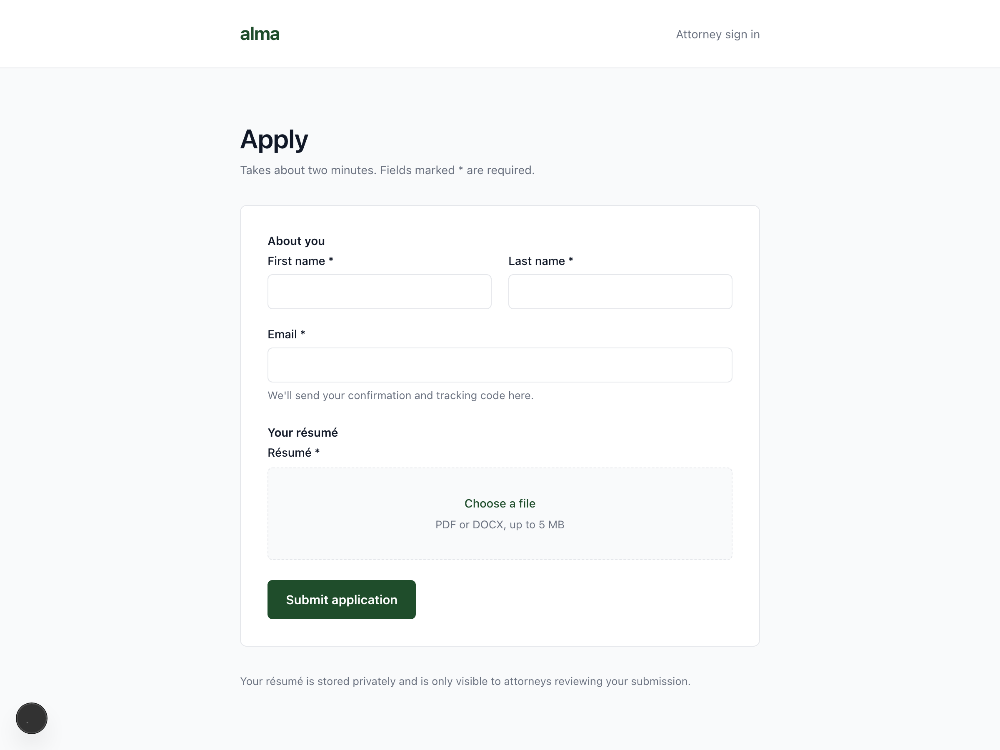
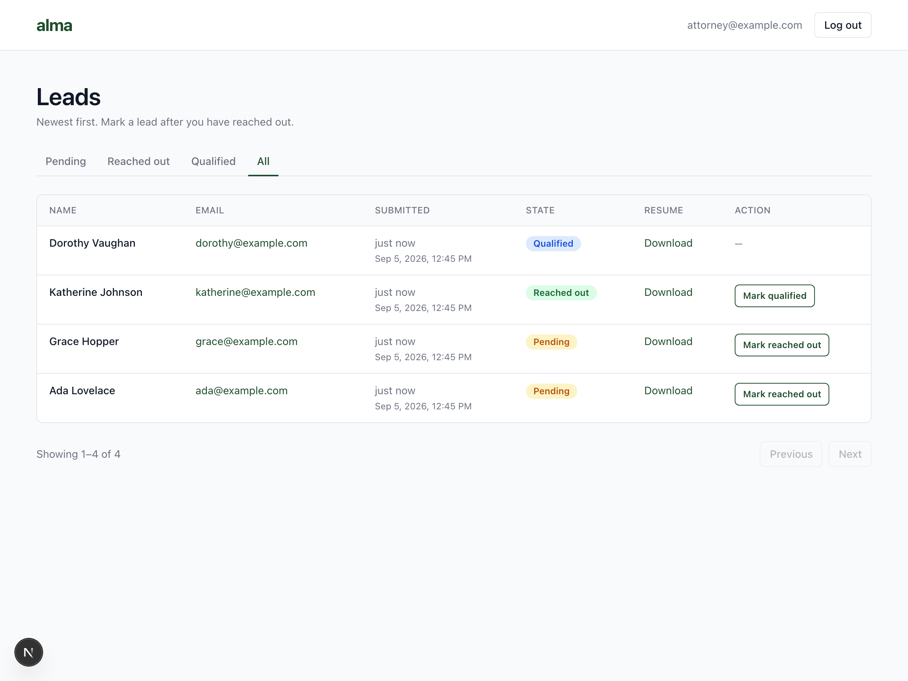
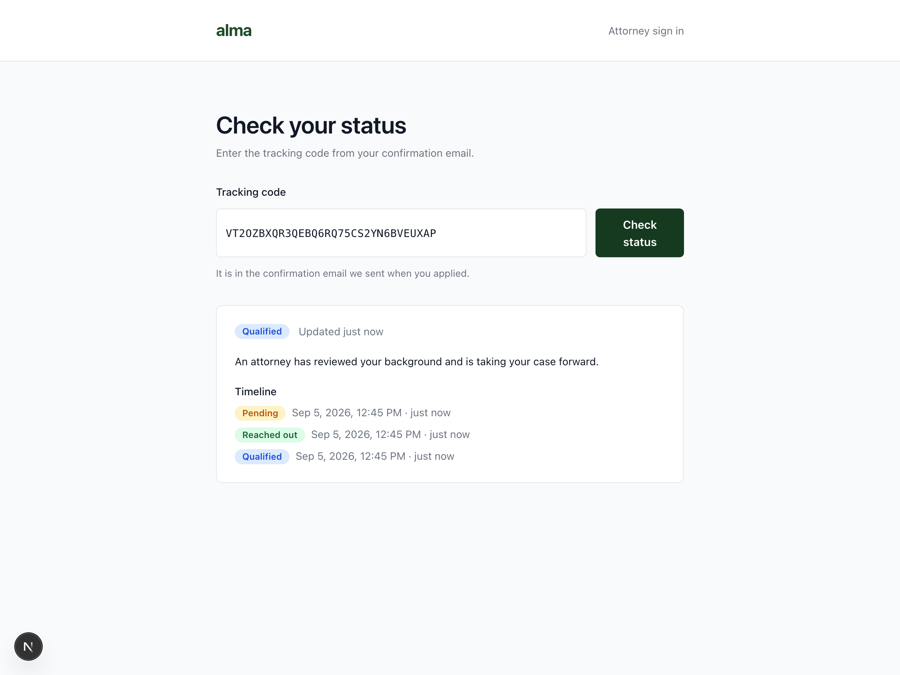

# Product quick guide

A one-page tour for a non-engineer. Technical reasoning lives in `DESIGN.md`.

## 1. What a prospect does

Fills in the public form at `/apply` — first name, last name, email, and a résumé (PDF or DOCX,
up to 5 MB) — and lands on a thank-you page. A confirmation email arrives with a **tracking
code**. Typing that code into `/status` shows the current stage and a dated timeline, and
nothing else: no name, no email, no file.

## 2. What an attorney does

Signs in at `/login` with a configured account, and gets the queue at `/leads`: every lead,
newest first, with tabs for each stage plus **Mine** and **Unassigned**. From a row they can
download the résumé, claim the lead with **Assign to me**, and move it forward — **Pending →
Reached out → Qualified**. Moving it backwards, or repeating a move another tab already made,
is refused; the list just refreshes.

## 3. What emails are sent, and when

| When | Who gets it | What it says |
|---|---|---|
| A lead is submitted | the prospect | confirmation, what was received, and the tracking code |
| A lead is submitted | the attorney inbox | the lead's details and a link into the queue |
| Marked **Reached out** | the prospect | an attorney has reviewed your submission and is reaching out |
| Marked **Qualified** | the prospect | an attorney assessed your background as a strong fit |

By default the app prints emails to the API console instead of sending them, so a demo needs no
provider account. Setting `RESEND_API_KEY` switches to real delivery with no code change.

## Where to look in the demo

`/apply` (submit) → the API console (both emails, with the tracking code) → `/status` (paste the
code) → `/login` → `/leads` (claim it, mark it reached out) → `/status` again (the timeline grew).
